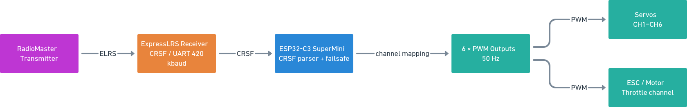
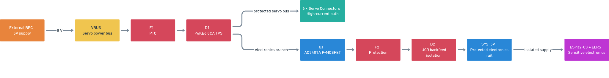

# OpenCRSF

**CRSF receiver → 6-channel PWM controller built around an ESP32-C3 SuperMini**

OpenCRSF is a custom RC electronics project developed to use an ExpressLRS receiver with hardware that expects conventional PWM signals.

The project began as a simple CRSF-to-PWM converter for an RC car. After a power-related hardware failure damaged an ELRS receiver, the project expanded into a protected controller with separate attention to signal handling, power distribution and fault protection.

> **Important:** V1 and V2 are intentionally documented separately. The firmware currently in the repository is the V1 firmware and is also intended for V2. V2 changes the power/protection hardware, not the CRSF-to-PWM application logic.

## What OpenCRSF does

RadioMaster transmitter  
→ ExpressLRS receiver  
→ **CRSF / UART**  
→ **ESP32-C3 SuperMini**  
→ **6 × PWM outputs**  
→ servos / ESC

The firmware parses CRSF frames, maps receiver channels to PWM outputs and applies failsafe positions when the receiver signal is lost.

### System architecture



## Why I built it

I was working on an RC car controlled by a FlySky FC-CT6B. I wanted to move to a RadioMaster transmitter with an ELRS receiver.

The receiver provides CRSF data, while the servos and ESC require standard PWM. Commercial CRSF-to-PWM solutions were either expensive or difficult to find, so I built my own converter.

The first prototype was assembled on perfboard and successfully controlled six servos and a motor. During a later test, connecting the BEC resulted in the ELRS receiver being damaged.

That failure changed the direction of the project. Instead of treating it as only a signal-conversion problem, I started redesigning the power side so the receiver, ESP32 and servo system would be less exposed to power faults.

## Hardware revisions

| Revision | Purpose | Status |
|---|---|---|
| **V1** | First working CRSF-to-PWM prototype | Built and tested |
| **V2** | Improved power distribution and protection | Hardware in development |
| **V3** | Dedicated buck-regulated electronics rail | Planned |

### V1

V1 was the first working hardware revision.

It was tested with:

- 6 PWM channels
- 6 servos
- a brushless motor / ESC
- ESP32-C3 SuperMini
- ELRS receiver

The V1 power section used a PTC fuse, TVS protection and bulk capacitors. It did not provide enough isolation between the high-current servo path and the sensitive electronics branch, and it had no reverse-polarity protection.

The V1 hardware is kept separate from the V2 design in the documentation.

### V2

V2 is focused primarily on the power and protection section.

The current V2 design uses a shared servo bus and a separately protected electronics branch:

- shared `VBUS` for the six servo connectors
- `F1` PTC protection
- `D1` P6KE6.8CA bidirectional TVS protection
- bulk capacitors on the shared bus
- `Q1` AO3401A P-channel MOSFET for the electronics branch
- `F2` and `D2` for additional protection and USB backfeed isolation
- separate `SYS_5V` rail for the ESP32 and ELRS receiver

The V2 schematic will be documented from the actual EasyEDA project files. No simplified drawing is used as a substitute for the electrical schematic.



See [V1 / V2 revision notes](docs/revisions.md) and [hardware documentation](docs/hardware.md).

### V3

V3 is planned around a buck regulator for the electronics rail. The objective is to make the ESP32 and ELRS receiver less dependent on the regulation quality of the external BEC.

## Firmware

The firmware is written for Arduino on the ESP32-C3.

Current firmware characteristics:

| Function | Implementation |
|---|---|
| MCU | ESP32-C3 SuperMini |
| Receiver protocol | CRSF |
| Receiver interface | UART |
| CRSF baud rate | 420000 |
| PWM outputs | 6 |
| PWM frequency | 50 Hz |
| Signal loss handling | Failsafe positions |
| Diagnostics | Serial output |

The firmware is modular. The development source tree contains separate components for:

- CRSF parsing
- CRC handling
- servo/PWM control
- failsafe handling
- configuration

The firmware currently shown in the repository is the **V1 firmware**. The same firmware architecture is intended to be used with V2 hardware.

See [firmware documentation](docs/firmware.md).

## Repository structure

```text
OpenCRSF/
├── README.md
├── LICENSE
├── .gitignore
├── firmware/
│   ├── OpenCRSF.ino.cpp
│   └── README.md
└── docs/
    ├── firmware.md
    ├── hardware.md
    └── revisions.md
```

Generated Arduino build output such as `core/`, object files, dependency files and binaries is intentionally not part of the source repository.

## Development status

### Completed

- CRSF input and parsing
- ESP32-C3 based PWM conversion
- 6-channel PWM output
- failsafe handling
- serial diagnostics
- working V1 prototype
- initial V2 power/protection architecture

### In progress

- V2 hardware implementation
- final V1/V2 EasyEDA documentation
- cleaned firmware source tree
- hardware test documentation

### Planned

- V3 buck-regulated electronics supply
- more systematic power-fault testing
- final PCB documentation

## What I learned from the project

OpenCRSF has developed from a small protocol-conversion experiment into a practical embedded hardware project:

**CRSF protocol → UART communication → PWM generation → failsafe logic → power distribution → protection → PCB design**

The most useful part of the project has been using an actual hardware failure to guide the next revision instead of treating the converter as only a software problem.

## Author

**Efe Bostancı**

Electrical and Electronics Engineering student  
Interested in embedded systems, UAVs, RC electronics and PCB design.

[GitHub profile](https://github.com/Efe-Bostanci) · [LinkedIn](https://www.linkedin.com/in/efe-bostanci-0b3997233)
